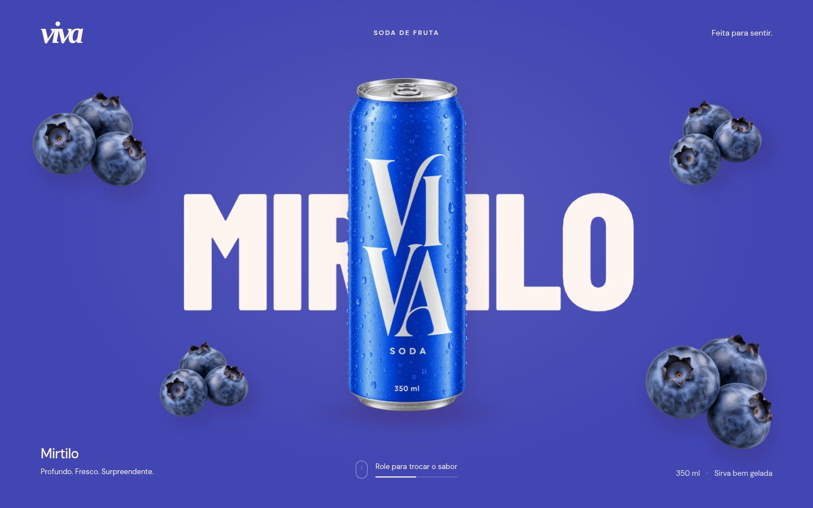

# soda-animation

Criei este projeto para testar animações, transições suaves e interações com scroll em uma interface de produto. A ideia foi explorar como tipografia, cores, imagens e movimento podem trabalhar juntos para apresentar diferentes sabores dentro de uma única hero.

Usei uma marca conceitual de bebidas, **VIVA**, como cenário para esses experimentos. O foco do projeto é o estudo de animação e experiência visual no front-end.



## O que explorei

- Troca entre morango, mirtilo e melancia por gestos de scroll.
- Transições completas entre sabores, com mudança de cor da lata e do fundo.
- Movimento de nomes e frutas em diferentes camadas.
- Animações sutis de flutuação e resposta ao movimento do mouse.
- Layout responsivo, controles por teclado e respeito à preferência por movimento reduzido.

Cada scroll inicia uma transição de aproximadamente 1,35 segundo e para no próximo sabor. Scrolls extras durante a animação são ignorados; para avançar novamente, é necessário um novo gesto depois da chegada. A hero ocupa a tela inteira, sem outras seções.

## Tecnologias

HTML, CSS e JavaScript puro, com `requestAnimationFrame`, transformações CSS e interpolação de cores. Sem frameworks ou bibliotecas de animação.

## Como executar

Abra `index.html` no navegador. Para usar um servidor local, execute na pasta do projeto:

```bash
npm run dev
```

O comando utiliza Python 3 para servir os arquivos em **http://127.0.0.1:4173**. Também é possível executar diretamente:

```bash
python3 -m http.server 4173 --bind 127.0.0.1
```

Não é necessário instalar dependências. As fontes do Google Fonts têm alternativas locais caso a página seja aberta sem internet.

## Estrutura

- `index.html` — composição da hero e dos sabores.
- `styles.css` — identidade visual, responsividade e animações de flutuação.
- `app.js` — gestos, transições e controles.
- `assets/` — imagens dos produtos e frutas.
- `docs/mirtilo.jpg` — captura real da interface no sabor mirtilo.

## Referências e imagens

O estudo partiu destas referências de interação:

- [Lata central, frutas e mudança de sabores](https://br.pinterest.com/pin/1026961521304025695/)
- [Transições de cores e produtos](https://br.pinterest.com/pin/917889967807370859/)
- [Movimento de frutas ligado à rolagem](https://br.pinterest.com/pin/1093671090766275413/)

As imagens da lata e das frutas foram geradas com IA para este projeto conceitual. A lata muda de cor por filtros e as cenas usam camadas de imagens; não há um modelo 3D. O projeto não representa uma marca comercial nem possui compras ou serviços externos conectados.

Desenvolvido por [Giselly Pereira](https://github.com/GisellyPereira).
